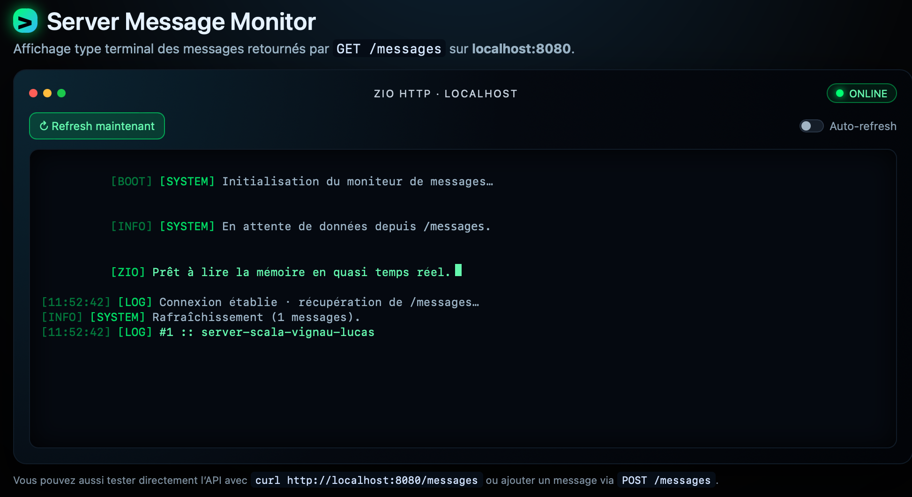

<div align="center">
  
# Serveur HTTP & WebSocket en Scala (ZIO)

</div>

## 📷 Interface 

<div align="center">
<br><br>
</div>


## 📌 Présentation du projet

Ce projet implémente un **serveur HTTP** complet utilisant :

- **Scala 3**
- **ZIO 2**
- **ZIO-HTTP 3.0.1**
- **ZIO-JSON**

Fonctionnalités réalisées selon les exigences du sujet :

✔️ API REST : `GET` et `POST`  
✔️ Stockage **en mémoire** avec `Ref[List[Message]]`  
✔️ WebSocket (bonus)  
✔️ Interface HTML WebSocket (client)  
✔️ Interface de monitoring du serveur via `/monitor`  

---

## 📁 Structure du projet

```bash
scala-server/
├── src/
│   ├── main/
│   │   ├── scala/
│   │   │   └── Main.scala
│   │   └── resources/
│   │       ├── test-ws.html
│   │       └── server-monitor.html
├── build.sbt
└── README.md
```

## 🌍 **Fonctionnement du serveur**

---

## 🔹 **1. GET `/messages`**

Récupère tous les messages stockés en mémoire.

**Commande :**

```bash
curl http://localhost:8080/messages
```
Exemple de réponse :
[
  {"text": "Bonjour"},
  {"text": "Message via WebSocket"}
]

## 🔹 **2. POST `/messages`**

Ajoute un message dans la mémoire du serveur.
Commande :

```bash
curl -X POST \
  -H "Content-Type: application/json" \
  -d '{"text":"Hello depuis REST !"}' \
  http://localhost:8080/messages
```

Réponse :

Message ajouté !

## 🔹 **3. WebSocket `/ws`**

## Connexion WebSocket :

ws://localhost:8080/ws

## Message JSON attendu :

{"text":"Hello WebSocket"}

## Le serveur effectue :
📥 parse du JSON \
📝 stockage du message \
📤 renvoi d'une confirmation \
❌ renvoi d'une erreur si le JSON est invalide \
🧪 Interface WebSocket (Client HTML)

## Le fichier :
src/main/resources/test-ws.html

## permet de tester :
la connexion WebSocket
l’envoi de messages
la réception des réponses

## Pour vérifier le stockage :

```bash
curl http://localhost:8080/messages
```

## 🖥️ **Monitoring du serveur (/monitor)

## Accessible via :
http://localhost:8080/monitor

## Fonctionnalités :
📡 affiche en direct les messages de /messages
🔄 rafraîchissement automatique toutes les 3 secondes
🔘 bouton "Refresh maintenant"
🖥️ interface style terminal
📊 état du serveur (ONLINE / OFFLINE)

## Fichier source :
src/main/resources/server-monitor.html

## 🧠 **Architecture interne

## Les messages sont stockés dans :
Ref[List[Message]]

## Ce Ref est partagé par :
les endpoints REST
le WebSocket
l’interface /monitor

➡️ Assure un stockage synchronisé sans base de données.

## 🚀 **Lancer le serveur**

```bash
sbt run
```

## Le serveur est accessible sur :

👉 http://localhost:8080

## 📡 **Endpoints disponibles**

## Endpoint	Méthode	Description

/messages	GET	Lire les messages \
/messages	POST	Ajouter un message \
/ws	GET	WebSocket (JSON) \
/monitor	GET	Interface de monitoring serveur

## 🔧 **Dépendances principales**

"dev.zio" %% "zio" % "2.0.19",\
"dev.zio" %% "zio-http" % "3.0.1", \
"dev.zio" %% "zio-json" % "0.6.2"

## 📦 **Exemples d’interaction WebSocket**

## Action	Réponse du serveur
{"text":"Test"}	Message enregistré: Test \
JSON invalide	JSON invalide: ... \
WebSocket fermé	Log côté serveur

## 🛠️ **Guide d’installation & d’exécution du projet**

## 🔹 1. Cloner le projet

```bash
git clone https://github.com/vignaulucas/scala-server.git
cd scala-server
```


## 🔹 2. Installer les dépendances (VS Code + Metals)

Installer l’extension Metals \
Attendre “Import Build” et l’accepter \
Metals installe automatiquement Scala / Bloop

## 🔹 3. Lancer le serveur Scala

Option 1 — Depuis VS Code \
Ouvrir Main.scala → bouton ▶️ Run\

Option 2 — Depuis sbt

```bash
sbt run
```

## 🔹 4. Tester le WebSocket (client HTML)

Ouvrir : \
src/main/resources/test-ws.html \
Actions possibles : \
connexion WebSocket \
envoyer un JSON \
recevoir la réponse du serveur \
Exemple de message JSON : \
{"text": "Hello depuis le WebSocket !"}

## 🔹 5. Accéder au monitoring serveur

Dans un autre onglet navigateur : \
http://localhost:8080/monitor 

Fonctionnalités : \
affichage des messages /messages \
rafraîchissement automatique \
bouton "Refresh maintenant" \
affichage style terminal

## 🔹 6. Vérifier le bon fonctionnement
Via WebSocket \
Envoyer un message depuis test-ws.html 

Via Monitoring \
Le message apparaît sur /monitor 

Via API REST \
curl http://localhost:8080/messages

## 🔹 7. Arrêter le serveur

Ctrl + C \
dans le terminal où tourne sbt run

<div align="center">
✨ Projet réalisé par Lucas Vignau
</div> ```
